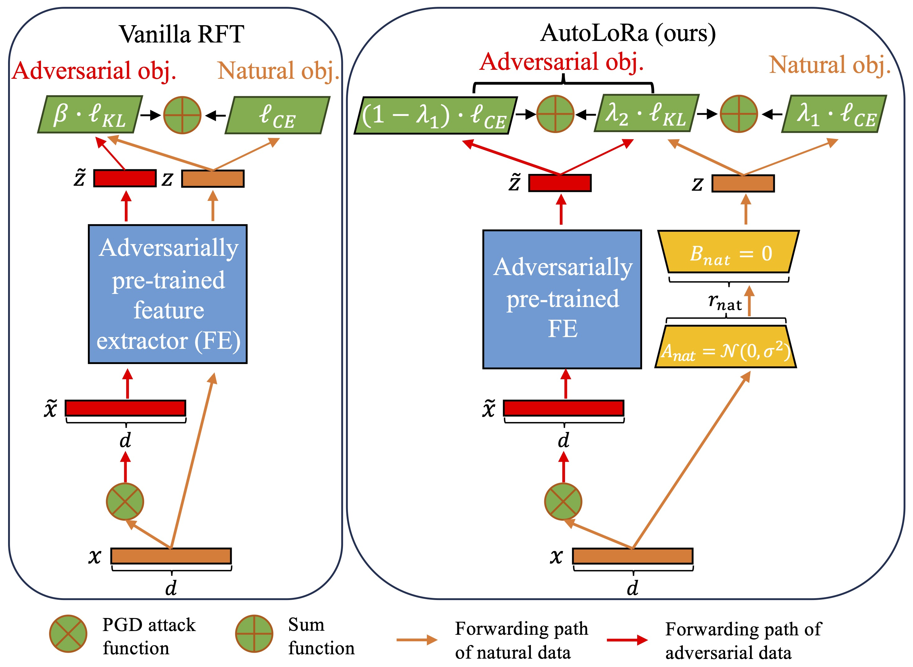
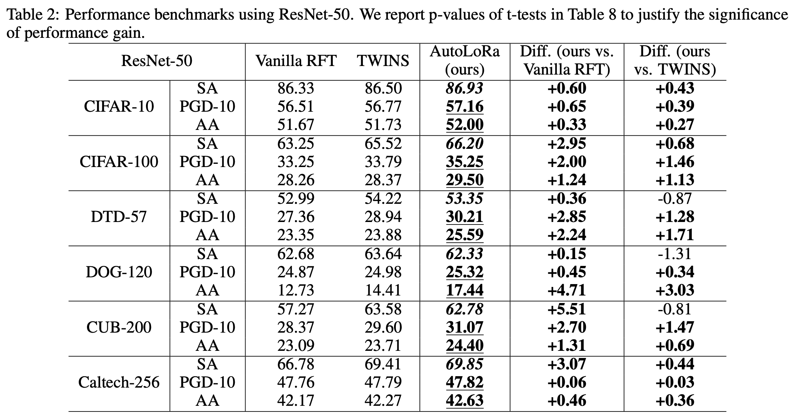

# AutoLoRa: A Parameter-Free Automated Robust Fine-Tuning Framework
This is the source code of the paper "AutoLoRa: A Parameter-Free Automated Robust Fine-Tuning Framework", <br>
Xilie Xu (NUS), Jingfeng Zhang (The University of Auckland/RIKEN-AIP), Mohan Kankanhalli (NUS). <br>
[[PDF](https://arxiv.org/abs/2310.01818)]

<div align="center">
    
</div>

<br>

AutoLoRa is an automated robust fine-tuning framework, which is composed of the following two key components:
- **A low-rank branch** (LoRa): making the model learn adversarial and natural data via the feature extractor and the LoRa, respectively.
- **An automatic scheduler of learning rate and scalars**: exempting the computational burden of searching for an appropriate hyper-parameters via grid search.


## Fine-Tuning on Low-Resolution Downstream Datasets

**Backbones:** Robust self-supervised pre-trained models downloaded from [Dropbox](https://www.dropbox.com/sh/h1hkv3lt2f2zvi2/AACp5IWNaMcqrYAu6hr__4yea?dl=0).

**Scripts:** [`run_autolora.sh`](./run_autolora.sh) provides the scripts to evaluate the transferabilitty from CIFAR-10/CIFAR-100 to STL-10 of 32 $\times$ 32 resolution.

If you would like to fine-tuning your own pre-trained weights, please use the following script:
```
python AutoLoRa.py --autolora 
                   --gpu gpu_id
                   --experiment exp_name
                   --dataset downstream_dataset: ['cifar10', 'cifar100', 'stl10'] 
                   --pretraining pre_training_method_name: ['ACL', 'AdvCL', 'A-InfoNCE', 'DeACL', 'DynACL', 'DynACL++', 'DynACL_AIR', 'DynACL_AIR++', 'DynACL_RCS'] 
                   --model model_arch: ['r18', 'r34', 'r50'] 
                   --checkpoint path_of_checkpoint
                   --mode finetuning_mode: ['ALL', 'SLF', 'ALF', 'AFF']
                   --eval-AA 
                   --eval-OOD            
```

**Performance:** AutoLoRa can further improve the robust test accuracy on the downstream dataset, whose the performance is presented in the leaderboards of [RobustSSL Benchmark](https://robustssl.github.io).

## Fine-Tuning on High-Resolution Downstream Datasets

**Backbones:** ImageNet-1K adversarially pre-trained models downloaded from https://github.com/microsoft/robust-models-transfer.

**Scripts:** [`run_autolora_HR.sh`](./high_resolution/run_autolora_HR.sh) provides the scripts to evaluate the transferabilitty from ImageNet-1K to high-resolution downstream tasks of 224 $\times$ 224 resolution, including DTD-57, DOG-120, CUB-200, and Caltech-256. 

If you would like to fine-tuning your own pre-trained weights, please use the following script:
```
python AutoLoRa.py --adv_train 
                   --model_root dir_to_save_model
                   --dataset downstream_task: ['cifar10', 'cifar100', 'dtd', 'dog', 'cub', 'caltech256']
                   --num_classes number_of_classes
                   --model_arch ['resnet18', 'resnet50'] 
                   --model-path path_of_pretrained_model
          
```

**Performance:** AutoLoRa can further improve the robust test accuracy on the downstream dataset without tuning the hyper-parameters as shown in the following table.

<div align="center">
    
</div>


## BibTeX
If you find the code useful, please cite our paper.
```
@article{xu2023autolora,
  title={AutoLoRa: A Parameter-Free Automated Robust Fine-Tuning Framework},
  author={Xu, Xilie and Zhang, Jingfeng and Kankanhalli, Mohan},
  journal={arXiv preprint arXiv:2310.01818},
  year={2023}
}
```
